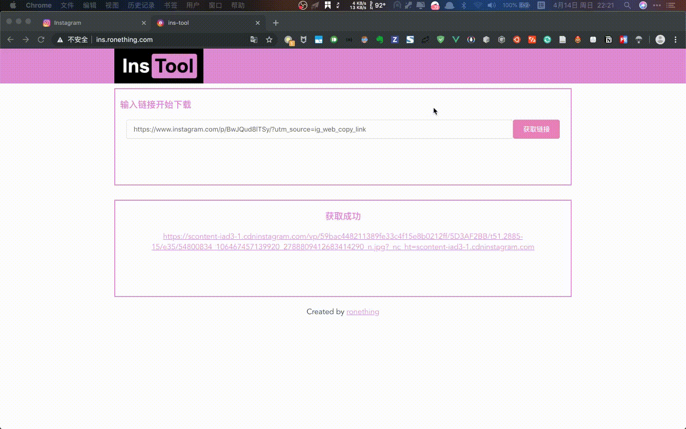

# ins-tool-client

## Introduction

ins 链接解析前端页面。很菜。刚学 CSS

## Development

```
yarn install
yarn run serve
yarn run build
```

## Demo Site

- [ins](http://ins.ronething.com)



## Change Log

- Sun Apr 14 21:15:19 first version

## Acknowledgement

- [MikuTools](https://miku.tools/)
